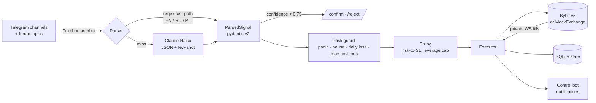

<div align="center">

# signal-copier

**Copies trade signals from Telegram channels to Bybit USDT perpetuals — with risk-based sizing, full trade management and a kill-switch.**

[](https://github.com/faceitall123qwe-hub/signal-copier/actions/workflows/ci.yml)


</div>

---

## Try it in 30 seconds — no API keys

```bash
pip install -r requirements.txt pytest
python demo.py      # scripted signals → real pipeline → in-memory exchange
pytest -q           # 31 tests, no network
```

```text
>>> message #1: LONG BTCUSDT Entry: 64000 SL: 63000 TP1: 65000 TP2: 66000
  🟢 ENTRY BTCUSDT long qty=0.1 @ 64000.0 | SL=63000.0 TP=[65000.0, 66000.0]
>>> exchange: fill entry
  🎯 SL+TP set BTCUSDT: SL=63000.0 TP=[65000.0, 66000.0]
>>> exchange: fill tp1
  ✂️ PARTIAL CLOSE BTCUSDT leg filled @ 65000.0
  🟰 SL -> breakeven BTCUSDT after TP1
>>> message #3: (same message delivered again)
  executor: duplicate entry — skipping
>>> message #4: thinking about going long on bitcoin soon maybe
  (regex miss -> would go to LLM parser)
>>> operator: /panic
>>> message #6: LONG SOLUSDT Entry: 150 SL: 145 TP: 165
  ⏭️ SKIP SOLUSDT: panic active (use /resume)
```

`demo.py` runs the **real** parser, risk guard, sizing and executor against
[`exchange/mock_exchange.py`](exchange/mock_exchange.py) — an in-memory exchange with the
same async interface as the Bybit client, which also emits the fill events the private
WebSocket would.

## How it works



**Trade lifecycle:** limit/market entry → on fill attach SL + split TP ladder → TP1 fill moves
SL to breakeven → management messages (move SL, replace TPs, partial / full close) are matched
to the right trade by source channel + topic, never across channels.

## Safety model

| Guard | Behaviour |
|---|---|
| **DRY_RUN by default** | Parses and logs only; TESTNET and LIVE are explicit modes |
| **LIVE gate** | Refuses to start unless `MODE=LIVE` **and** `CONFIRM_LIVE=I_UNDERSTAND` |
| **Idempotency** | `orderLinkId = sha1(channel_id:message_id)` — restarts and re-delivered messages never double-fire |
| **Liquidation-safe leverage** | Size comes from risk-to-SL only; leverage is capped so the stop always triggers before liquidation |
| **Kill-switch** | `/panic` cancels and flattens everything and blocks new entries until `/resume` |
| **Circuit breakers** | Max concurrent positions, max daily loss halt |
| **Low-confidence signals** | Held for a human `/confirm` instead of being traded |
| **Secrets** | Only in `.env`; third-party loggers silenced so tokens never reach logs |

## Control bot

`/status` `/positions` `/pnl` `/pause` `/resume` `/panic` `/risk` `/mode` `/confirm` `/reject` `/sources`
— accepted only from the configured owner ID.

## Project layout

```
parser/       regex fast-path, LLM fallback, pydantic schema, few-shot examples
core/         executor (routing + state machine), risk guard, trade state, notifier
exchange/     Bybit v5 client (sync SDK offloaded to threads), sizing, MockExchange
storage/      aiosqlite persistence: trades, processed messages, PnL log
tests/        parser, sizing, state, end-to-end executor on MockExchange
```

## Running for real

```bash
cp .env.example .env                 # Telegram API, control bot token, Bybit keys, Anthropic key
python generate_session.py           # Telethon session for a secondary account in the source channels
python main.py                       # MODE=DRY_RUN → TESTNET → LIVE
```

Fill `parser/examples.py` with real messages from your sources to anchor the LLM parser.
Two Telegram identities are used: a userbot that *reads* channels (the Bot API can't read
third-party channels) and your own control bot that *commands* the copier.

> Not financial advice. Trading perpetual futures can lose more than the stake; run on testnet first.
